<h1 align="center">Holiday Campaign Optimization & Long‑Term Retention</h1>
<h2 align="center">Global Retail - Python</h2>

  
Author: Chris Nguyen/ Dinh Khoi Nguyen

Finished Date: 2025/07/11  

Uploaded Date: 2025/11/21

Tools Used: Python  

---

## 📑 Table of Contents  
1. [📌 Background & Overview](#-background--overview)  
2. [📂 Dataset Description & Data Structure](#-dataset-description--data-structure)  
3. [📊 RFM Analysis](#-rfm-analysis)  
4. [🔎 Final Conclusion & Recommendations](#-final-conclusion--recommendations)  

---

## 📌 Background & Overview  

### Background
SuperStore is a global retail company headquartered in the UK, serving thousands of customers across multiple international markets. Over recent years, the company has transitioned from small-scale operations to enterprise-level retail, generating $8.3 million in revenue from 4,330 customers.
- Industry: Global retail
- Customer Base: Primarily UK (90%), with growing international segments
- Revenue Model: Direct-to-consumer sales through retail channels
- Growth Stage: Rapid expansion requiring advanced analytics for customer management
- Seasonal Opportunity: Christmas and New Year represent the most critical business period, with peak spending and relationship-building potential
The company’s Marketing team faces challenges in segmenting and targeting customers effectively. Manual Excel-based analysis is no longer sufficient, creating a need for automated, scalable solutions to support personalized campaigns and maximize holiday season ROI.

### Objective

📖 What is this project about? What Business Question will it solve?

This project applies Python and customer analytics to segment SuperStore’s customer base using the RFM (Recency, Frequency, Monetary) model. It transforms raw transaction data into actionable insights for holiday campaign planning and long-term retention strategies.

✔️ Segment customers into meaningful groups (Champions, Promising, New, At-Risk)

✔️ Identify spending patterns and engagement behaviors across UK and international markets

✔️ Highlight high-value customers and at-risk segments for targeted campaigns

✔️ Provide evidence-based recommendations to optimize holiday marketing and maximize ROI

 <details><summary>📌 Click here to know more about RFM Analysis</summary>

### 📌 What Is RFM?
- **Recency (R):** Measures how recently a customer purchased. Customers who bought more recently are more likely to buy again.  
- **Frequency (F):** Tracks how often a customer makes purchases. Frequent buyers are typically more loyal and engaged.  
- **Monetary (M):** Captures how much money a customer spends. High spenders contribute more to revenue and may respond well to premium offers.  

Together, these three metrics form a composite score that helps categorize customers into actionable segments such as *Champions*, *Loyal*, *At Risk*, or *Lost*.

---

### 🎯 Why We Need RFM Analysis
- **Customer Prioritization:** Identifies which customers are worth investing in — e.g., those who buy often and spend more.  
- **Targeted Marketing:** Enables tailored campaigns based on customer behavior (e.g., loyalty rewards for *Champions*, win‑back offers for *At Risk*).  
- **Improved Retention:** Highlights customers slipping away (low recency/frequency) so businesses can act before losing them.  
- **Revenue Optimization:** Directs focus toward high‑Monetary customers to maximize ROI.  
- **Simplicity & Actionability:** Easy to calculate and interpret, making it ideal for teams needing fast, data‑driven decisions.  

---

### 📚 References
Shopify. *RFM Analysis: How to Segment Customers and Increase Retention*. Retrieved from [Shopify Blog](https://www.shopify.com/blog/rfm-analysis)

</details>


Main Business Question:

➡️ How can SuperStore leverage automated customer segmentation to design personalized holiday campaigns that increase sales, strengthen loyalty, and reduce churn across global markets?

👤 Who is this project for?

✔️ Data analysts & business analysts – to build segmentation models and interpret customer behavior

✔️ Marketing teams – to design personalized campaigns based on customer value and engagement

✔️ CRM managers – to improve retention strategies and lifecycle management

✔️ Business leaders & stakeholders – to make data-driven decisions that maximize holiday season revenue and long-term growth


---

## 📂 Dataset Description & Data Structure  
<details><summary>Click here to know more</summary>

### 📌 Data Source  
- Source:([Dataset/ecommerce retail.xlsx](https://github.com/DatawithChrisNguyen/python-RFM-sas/blob/main/ecommerce--retail.xlsx))  
- Size: 541909 rows x 8 columns
- Format: xlsx

### 📊 Data Structure & Relationships  

#### 1️⃣ Tables Used:  
There is 1 table used for building the RFM model

#### 2️⃣ Table Schema & Data Snapshot  

Table: Ecommerce Retail Table  

---

### 📊 Dataset Overview

| Column Name   | Data Type     | Description                                                                 |
|---------------|---------------|------------------------------------------------------------------------------|
| `InvoiceNo`   | Object  | Unique 6-digit transaction ID. If it starts with 'C', it indicates a cancellation. |
| `StockCode`   | Object  | Unique 5-digit product/item code.                                           |
| `Description` | Object  | Name of the product/item.                                                  |
| `Quantity`    | Integer         | Number of units purchased per transaction.                                 |
| `InvoiceDate` | Datetime        | Date and time when the transaction occurred.                               |
| `UnitPrice`   | Float           | Price per unit in GBP (£).                                                 |
| `CustomerID`  | Float           | Unique 5-digit customer identifier.                                        |
| `Country`     | Object  | Country where the customer resides.                                        |

---


</details>
</p>

## ⚒️ Main Process

### 1️⃣ Data Cleaning & Preprocessing
<details><summary>Click here to know more</summary>
    
_Checking the data_
```ruby
print(records.info())
print(records.shape)
```
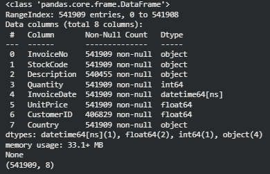

Here, I can identify the data type.

_Getting the unique value of each attribute_
```ruby
for col in records.columns:
    print(f"Column: {col}")
    print(f"→ Unique values count: {records[col].nunique()}")
    print(f"→ Unique values: {records[col].unique()}")
    print('-' * 50)
```

**Country Value**

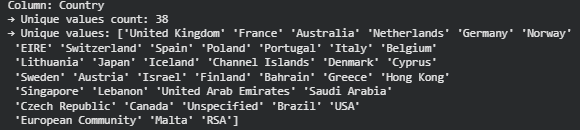

- 🌍 The list contains a wide mix of European countries (UK, France, Germany, Spain, Italy, Poland, etc.) alongside global entries like USA, Canada, Brazil, Japan, and Australia.
- 🏷️ There are a few aliases or abbreviations (EIRE = Ireland, RSA = South Africa, USA = United States of America).
- ⚠️ Some entries are not sovereign countries but regions or placeholders (Channel Islands, Hong Kong, European Community, Unspecified).
- ✅ Overall, the column is mostly valid countries, with just a handful of entries that may need cleaning or clarification

**Quantity Value**

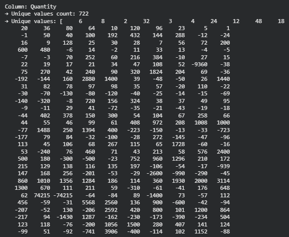

- We can see that some negative values are abnormal for the sales table. We need to have a deeper look at the reason why we have this.

_Further checking at the "Description" attribute_

At this step, I will take a deeper look at the value where the quantity is lower than 0

```ruby
# Filter the DataFrame for rows where Quantity is less than 0 and Description is not missing
negative_quantity_descriptions = records[(records['Quantity'] < 0) & (records['Description'].notna())]

# Get the set of unique descriptions
descriptions = set(negative_quantity_descriptions['Description'])

# Display results
print("Distinct Descriptions where Quantity < 0:")
for desc in descriptions:
    print(desc)
```

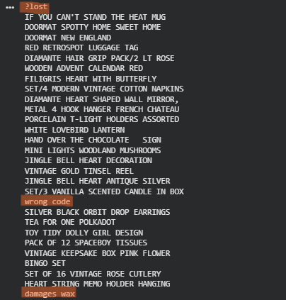

Looking at the note, we can highlight that there are some reasons leading to this problem, such as "damaged goods" and "missing items". This problem can not be handled, so I choose to drop those values.

_Checking missing value_

```ruby
for i in records.iloc[:,0:]:
  miss=records[i].isna().sum()
  print(i,'missing: ', miss)
```

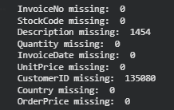

Here, we can see that there is quite a lot of data that has been missing. Finding a way to handle them is an important step we need to focus on before moving further.

_Handling the target value_

After checking the dataset, there are some rules that I have noticed and give a few assumptions for them:

- For the orders having "Quantity" and "Price" but no "CustomerID", there is the assumption that these orders belong to the "IMPORT" section and don't need to be considered in our model
- For the orders having no "CustomerID" and set "Price" ="0", there are some seasons that have been figured out, like "lost, wrong input". For these data, we don't really need it.
- For the two inputs having the "Unit Price ='-11062.06', they have been classified as "Adjust bad debt', which I assume is unnecessary for our department.

```ruby
# Step 1: Drop rows with conditions
cond1 = records['CustomerID'].isna() & records['Quantity'].notna() & records['UnitPrice'].notna()
cond2 = records['CustomerID'].isna() & (records['UnitPrice'] == 0)
cond3 = records['UnitPrice'] == -11062.06

records_cleaned = records[~(cond1 | cond2 | cond3)].copy()
```

```ruby
# Show how many rows were dropped
rows_dropped = records.shape[0] - records_cleaned.shape[0]
print(f"Number of rows dropped: {rows_dropped}")

print("Missing values per column after cleaning:")
print(records_cleaned.isna().sum())
```

After processing the first missing data handling with the above three conditions, all the problems have been solved. Now, the dataset can be considered clean for further steps.

```ruby
# Step 2: Create 'OrderPrice'
records['OrderPrice'] = records['Quantity'] * records['UnitPrice']

# Step 3: Remove customers with only negative OrderPrice
has_positive_order = records.groupby('CustomerID')['OrderPrice'].apply(lambda x: (x > 0).any())
valid_customers_order = has_positive_order[has_positive_order].index
invalid_customers_order = has_positive_order[~has_positive_order].index

records_valid = records[records['CustomerID'].isin(valid_customers_order)].copy()
Just_Returned_Order_Customer = records[records['CustomerID'].isin(invalid_customers_order)].copy()
})
```
Creating a new attribute named "*OrderPrice" is for capturing the value of each partial part of the order, which we can use later. Here, we divide the dataset into two parts with these definitions:
  - "Just_Returned_Order_Customer" contains the value that does not have any positive transactions in the targeted period of time.
  - "records_valid" is the actual real transactions that we have, which are needed for the RFM model we are heading to.

```ruby
print("Records with Valid RFM Segments:")
print(records_valid)

print("\nCustomers Who Just Returned an Order:")
print(Just_Returned_Order_Customer)
```

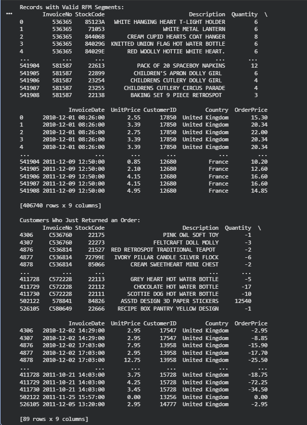


</details>
</p>

✅ Key Actions Taken
- Identified country value inconsistencies:
  
  Highlighted aliases (EIRE, RSA, USA) and non‑country entries (Channel Islands, Hong Kong, European Community, Unspecified) as potential issues, flagged for confirmation with another department before cleaning.
  
- Handled abnormal quantity values:
  
  Found negative quantities linked to damaged or missing goods and dropped those rows to maintain data integrity.
  
- Addressed missing and invalid records:
  
  Removed rows with missing CustomerID combined with invalid UnitPrice (e.g., 0 or ‑11062.06), treating them as imports, wrong inputs, or debt adjustments.
  
- Created new analytical attribute:
  
  Added OrderPrice (Quantity × UnitPrice) to capture transaction value, enabling segmentation of customers.
  
- Segmented dataset for modeling:
  
  Split data into:
  - records_valid → customers with positive transactions (for RFM analysis).
  - Just_Returned_Order_Customer → customers with only returns and no positive orders.

---

### 2️⃣ Modifying the Dataset for RFM Segmentation 
<details><summary>Click here to know more</summary>
  
_Dropping unnecessary value_

```ruby
# Drop Quantity and UnitPrice first
records_valid = records_valid.drop(columns=['StockCode','Description'])

print(records_valid)
```
_RFM component modification_

**Recency Score**
```ruby
# Make sure InvoiceDate is a datetime type
records_valid['InvoiceDate'] = pd.to_datetime(records_valid['InvoiceDate'])

# Reference date to subtract from
reference_date = pd.to_datetime('2011-12-31')

# Get the most recent InvoiceDate per CustomerID
last_purchase = records_valid.groupby('CustomerID')['InvoiceDate'].max()

# Calculate recency as the days difference
recency = (reference_date - last_purchase).dt.days

# Add recency column to your DataFrame (e.g., df_grouped)
records_valid['recency'] = records_valid['CustomerID'].map(recency)

print(records_valid[['CustomerID', 'recency']])
```
Taking 31/12/2011 as the mark point for the calculation, the "recency" is formed by taking the real-time date between the latest transaction date with the target date.

**Frequency Score**
```ruby
frequency = records_valid.groupby('CustomerID')['Inv  oiceNo'].nunique()
records_valid['frequency'] = records_valid['CustomerID'].map(frequency)

print(records_valid)
```
"frequency" shows the number of transactions shown during the active time of each customer.

**Monetary Score**
```Ruby
# Drop 'Quantity' and 'UnitPrice' as they're no longer needed
records_valid = records_valid.drop(columns=['Quantity', 'UnitPrice'])

# Group by 'InvoiceNo' and aggregate relevant fields
records_valid = records_valid.groupby('InvoiceNo').agg({
    'OrderPrice': 'sum',
    'CustomerID': 'first',
    'Country': 'first',
    'recency': 'first',
    'frequency': 'first'
}).reset_index()

# Preview the resulting DataFrame
print(records_valid)
```
"monetary" aka "OrderPrice" gives the value of the total pay of each customer when combining every single transaction.
```ruby
# Group by CustomerID and aggregate
records_RFM = records_valid.groupby('CustomerID').agg({
    'OrderPrice': 'sum',
    'Country': 'first',
    'recency': 'first',
    'frequency': 'first'
}).reset_index().rename(columns={'OrderPrice': 'monetary'})
```
_Handling Negative Monetary Customer_

```ruby
# Count how many customers have monetary < 0
count_negative = records_RFM[records_RFM['monetary'] < 0]['CustomerID'].nunique()
print(f"Number of customers with monetary < 0: {count_negative}")

# List those customers
negative_monetary_customers = records_RFM[records_RFM['monetary'] < 0]['CustomerID'].unique()
print("Customers with monetary < 0:")
print(negative_monetary_customers)

# Step 2: Create a separate DataFrame for removed customers
negative_monetary_df = records_RFM[records_RFM['CustomerID'].isin(negative_monetary_customers)]

# Show a sample (e.g., first 5 rows) of removed records
print("\nSample of removed records (monetary < 0):")
print(negative_monetary_df.head())

# Step 3: Remove them from the main dataset
records_RFM = records_RFM[~records_RFM['CustomerID'].isin(negative_monetary_customers)].copy()
```
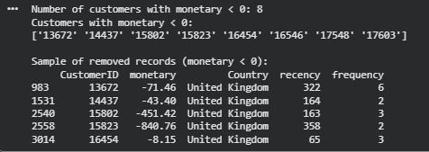

We have identified that there are 8 customers with negatives for "Monetary", which can be considered as inappropriate for the model.

```ruby
print (records_RFM)
records_RFM.describe
**Categorical Variables**
```


_Final Formatting Attributes_
```ruby
#Remove duplicated edge values to retain only distinct boundaries.
recency_bins = np.unique(np.percentile(records_RFM['recency'], [0,20,40,60,80,100]))
frequency_bins = np.unique(np.percentile(records_RFM['frequency'], [0,20,40,60,80,100]))
monetary_bins = np.unique(np.percentile(records_RFM['monetary'], [0,20,40,60,80,100]))

#Apply pd.cut using these bin edges.
records_RFM['Recency_Score'] = pd.cut(records_RFM['recency'], bins=recency_bins, labels=range(len(recency_bins)-1,0,-1), include_lowest=True)
records_RFM['Frequency_Score'] = pd.cut(records_RFM['frequency'], bins=frequency_bins, labels=range(1,len(frequency_bins)), include_lowest=True)
records_RFM['Monetary_Score'] = pd.cut(records_RFM['monetary'], bins=monetary_bins, labels=range(1,len(monetary_bins)), include_lowest=True)

print(records_RFM)
```


- Remove duplicated percentile edges to ensure clean and distinct bin boundaries
- Create recency bins to classify customers by how recently they purchased
- Create frequency bins to measure how often customers make transactions
- Create monetary bins to categorize customers by spending levels
- Assign RFM scores so each customer has standardized values for comparison and segmentation


```ruby
# Ensure all 3 score columns are string type before concatenation
records_RFM['RFM_Score'] = (
    records_RFM['Recency_Score'].astype(str) +
    records_RFM['Frequency_Score'].astype(str) +
    records_RFM['Monetary_Score'].astype(str)
)

# View result
print(records_RFM[['CustomerID', 'RFM_Score']].head())
```
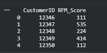

```ruby
# Dictionary: RFM_Score → Segment
rfm_segments = {
    "Champions": ['555', '554', '544', '545', '454', '455', '445'],
    "Loyal": ['543', '444', '435', '355', '354', '345', '344', '335'],
    "Potential Loyalist": ['553', '551', '552', '541', '542', '533', '532', '531', '452', '451', '442', '441',
                           '431', '453', '433', '432', '423', '353', '352', '351', '342', '341', '333', '323'],
    "New Customers": ['512', '511', '422', '421', '412', '411', '311'],
    "Promising": ['525', '524', '523', '522', '521', '515', '514', '513', '425', '424', '413', '414', '415',
                  '315', '314', '313'],
    "Need Attention": ['535', '534', '443', '434', '343', '334', '325', '324'],
    "About To Sleep": ['331', '321', '312', '221', '213', '231', '241', '251'],
    "At Risk": ['255', '254', '245', '244', '253', '252', '243', '242', '235', '234', '225', '224', '153',
                '152', '145', '143', '142', '135', '134', '133', '125', '124'],
    "Cannot Lose Them": ['155', '154', '144', '214', '215', '115', '114', '113'],
    "Hibernating customers": ['332', '322', '233', '232', '223', '222', '132', '123', '122', '212', '211'],
    "Lost customers": ['111', '112', '121', '131', '141', '151']
}

# Flatten into a score → segment mapping
score_to_segment = {score: segment for segment, scores in rfm_segments.items() for score in scores}

# Apply mapping to a new column
records_RFM['Segment'] = records_RFM['RFM_Score'].map(score_to_segment)

# Optional: fill NaN as 'Others' or 'Unclassified'
records_RFM['Segment'] = records_RFM['Segment'].fillna('Unclassified')

# View result
print(records_RFM[['CustomerID','Country', 'RFM_Score', 'Segment']].head())
```
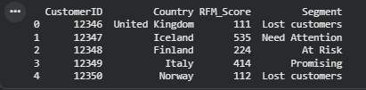


- Define mapping rules to translate RFM scores into meaningful customer segments
- Flatten the dictionary so each score directly links to its segment category
- Apply the mapping to assign a segment label for every customer in the dataset
- Fill missing values with “Unclassified” to avoid gaps in segmentation results
- Produce a clear view of customers with their RFM score and assigned segment for analysis

</details>
</p>

✅ Key Actions Taken
- Prepared dataset for RFM analysis:
Dropped unnecessary fields (StockCode, Description, Quantity, UnitPrice) to retain only relevant attributes for modeling.
- Calculated RFM components:
- Recency → measured days since last purchase relative to 31/12/2011.
- Frequency → counted distinct transactions per customer.
- Monetary → aggregated total order value across invoices.
- Handled invalid monetary values:
Identified 8 customers with negative monetary scores and removed them from the dataset to ensure model accuracy.
- Created scoring bins:
Applied percentile‑based binning for recency, frequency, and monetary values, then assigned scores (1–5) to each customer.
- Generated composite RFM score:
Concatenated the three component scores into a single RFM_Score string for each customer.
- Segmented customers:
Mapped RFM scores into meaningful segments (e.g., Champions, Loyal, At Risk, Lost Customers) to support targeted marketing and retention strategies.

---
## 📊 RFM Analysis
_Summary Analysis_

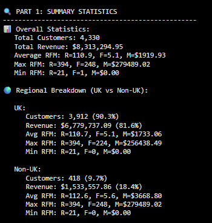

📊 Analysis Highlights
- Customer Distribution:
The majority of customers are from the UK (90.3%), indicating a strong domestic base.
- Revenue Contribution:
UK customers contribute 81.6% of total revenue, while non-UK customers, though fewer, show higher average spending.
- Average RFM Scores:
- Overall: R=110.9, F=5.1, M=$1919.93
- UK: R=110.7, F=5.1, M=$1733.06
- Non‑UK: R=112.6, F=5.6, M=$3668.80
→ Non‑UK customers are slightly less recent but more frequent and significantly higher in monetary value.
- Customer Value Extremes:
- Max monetary value reaches nearly $280K, showing the presence of high‑value customers.
- Min monetary is $0, indicating inactive or return‑only customers.

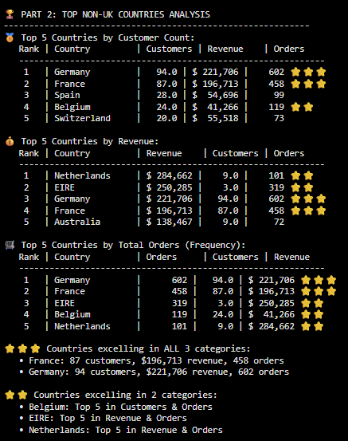

⭐ Star Assignment Logic
- Compare each country’s presence across three top 5 lists: Customers, Revenue, and Orders
- If a country appears in all three lists, assign ⭐⭐⭐
- If a country appears in two lists, assign ⭐⭐
- If a country appears in only one list, no stars are added
- This visual cue helps quickly highlight countries with consistent performance across multiple metrics

📊 Analysis Highlights
- Germany and France are top performers across all three metrics — strong customer base, high revenue, and frequent orders.
- The Netherlands, EIRE (Ireland), and Belgium show strength in two categories, indicating targeted potential for growth.
- Germany leads in customer count and order volume, while the Netherlands and EIRE lead in revenue despite smaller customer bases, suggesting high-value transactions.
- This segmentation helps prioritize international markets for marketing, retention, and expansion strategies.

---
_RFM Score Statistics_

Non-UK customers tend to spend more per person but are less frequent and less recent compared to UK customers. This suggests they may be high-value but harder to retain.

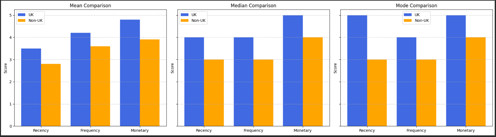

🌍 UK vs Non-UK Customer Behavior (RFM Score Highlights)
- Recency (How recently customers purchased):
  - UK customers tend to buy more recently than non-UK customers.
  - This means UK customers are more active and engaged in the short term.
- Frequency (How often customers purchase):
  - UK customers place more orders on average.
  - Non-UK customers buy less often, suggesting lower repeat engagement.
- Monetary (How much customers spend):
  - Non-UK customers spend significantly more per order than UK customers.
  - They are fewer in number but contribute high revenue individually.

---

_RFM Correlation Heatmap_

UK and Non-UK customers show different relationships between RFM scores. UK customers have stronger links between frequency and spending, while Non-UK customers show slightly higher recency–frequency correlation.

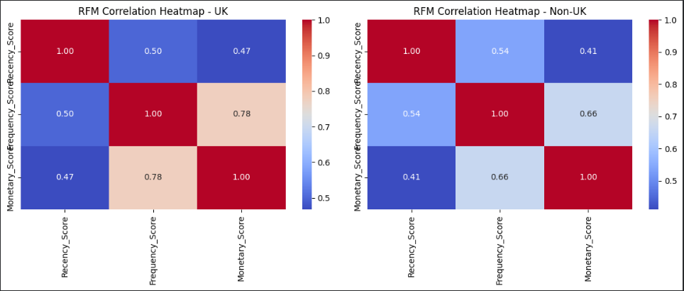

🔥 RFM Score Relationships – UK vs Non-UK
- Frequency vs Monetary (How often vs how much):
  - UK customers: Strong correlation (0.78) — those who buy more often tend to spend more.
  - Non-UK customers: Still strong but lower (0.66) — frequent buyers spend more, but less predictably.
- Recency vs Frequency (How recent vs how often):
  - Non-UK customers: Slightly stronger correlation (0.54) than UK (0.50) — recent buyers are more likely to be frequent buyers.
  - This suggests Non-UK engagement may be more time-sensitive.
- Recency vs Monetary (How recent vs how much):
  - UK customers: Moderate correlation (0.47) — recent buyers tend to spend more.
  - Non-UK customers: Lower correlation (0.41) — spending is less tied to how recently they purchased.
---

_Segment Distribution_ 

**🏁 Overall Trends**

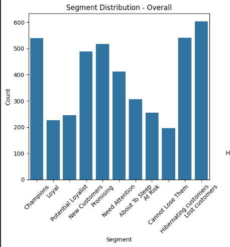


- The largest segment overall is Lost Customers, followed by Hibernating and Promising.
- This indicates a significant portion of the customer base is inactive or at risk.

**Breakdown**

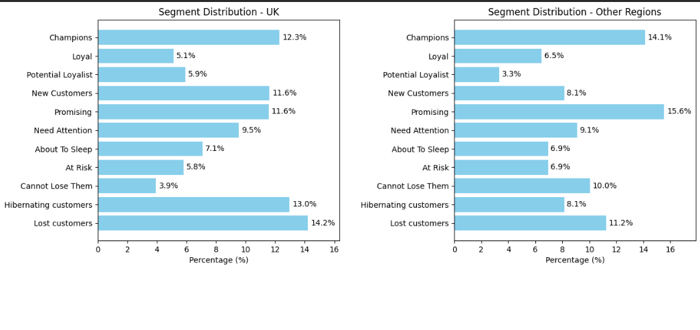

Non-UK customers show a stronger presence in high-value segments like “Champions” and “Promising,” while UK customers have a larger share in inactive or lost categories. This suggests different engagement strategies are needed for each region.

🇬🇧 UK Customers
- 14.2% are Lost Customers — the highest among all segments.
- 13.0% are Hibernating — showing low engagement but potential for reactivation.
- Only 12.3% are Champions — loyal, high-value customers.
- Suggests the UK market has more dormant customers needing re-engagement.
- 
🌍 Non-UK Customers
- 14.1% are Champions — higher than the UK, showing stronger top-tier loyalty.
- 15.6% are Promising — new or growing customers with potential.
- Only 11.2% are Lost Customers — lower than the UK.
- Indicates Non-UK customers are more likely to be active and valuable.
- 
## 🔎 Final Conclusion & Recommendations  

🇬🇧 UK Market Analysis & Strategy

📊 What We See
- Customer Base: 3,912 customers (90.3% of total)
- Revenue Contribution: $6.78M (81.6% of total)
- Average RFM Scores:
  - Recency: 110.7
  - Frequency: 5.1
  - Monetary: $1,733.06
- Segment Distribution Highlights:
  - 14.2% are Lost Customers
  - 13.0% are Hibernating
  - Only 12.3% are Champions

🧠 What It Means
- UK customers are active and frequent, but spend less per transaction than non-UK.
- A large portion of the UK base is inactive or disengaged, with nearly 27% falling into Lost or Hibernating segments.
- Strong correlation between frequency and monetary scores (0.78) suggests that repeat buyers are more valuable.
🚀 What We Recommend
- 🔁 Reactivation Campaigns:
    Target Lost and Hibernating customers with time-limited offers, personalized emails, and reminders to re-engage.
- 🎯 Loyalty Incentives for Frequent Buyers:
    Use the strong frequency–monetary link to reward repeat purchases with tiered discounts or early access to new products.
- 📦 Segment-Based Messaging:
    - Champions: Appreciation and exclusivity
    - At Risk: Urgency and retention offers
    - New Customers: Onboarding and education
- 📊 Monitor Engagement Trends:
    Track recency and frequency shifts monthly to detect early signs of churn and intervene proactively.

🌍 Non-UK Market Analysis & Strategy

📊 What We See
- Customer Base: 418 customers (9.7% of total)
- Revenue Contribution: $1.53M (18.4% of total)
- Average RFM Scores:
  - Recency: 112.6
  - Frequency: 5.6
  - Monetary: $3,668.80
- Segment Distribution Highlights:
  - 14.1% are Champions
  - 15.6% are Promising
  - Only 11.2% are Lost Customers

🧠 What It Means
- Non-UK customers are **high spenders**, with average monetary value **more than double** that of UK customers.
- They are less recent and less frequent, but more valuable per transaction.
- Correlation between recency and frequency is slightly stronger (0.54), suggesting timing matters more for engagement.

🚀 What We Recommend
- 💎 Premium Retention Strategy:
    Focus on Champions and Promising segments with loyalty programs, exclusive bundles, and personalized service.
- ⏱️ Time-Sensitive Offers:
    Use recency–frequency correlation to trigger campaigns based on inactivity windows (e.g., 30–60 days since last purchase).
- 🌐 Country-Level Prioritization:
    Invest in top-performing countries:
    - Germany: 94 customers, $221K revenue, 602 orders
    - France: 87 customers, $197K revenue, 458 orders
    - Netherlands & EIRE: High revenue despite small customer base
- 📦 Localized Messaging & UX:
    Tailor content and checkout experience to regional preferences to reduce friction and boost conversion.


